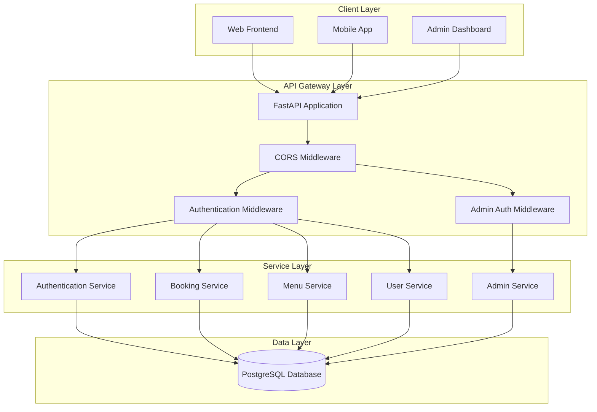
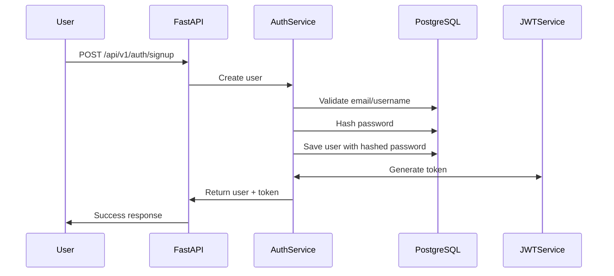
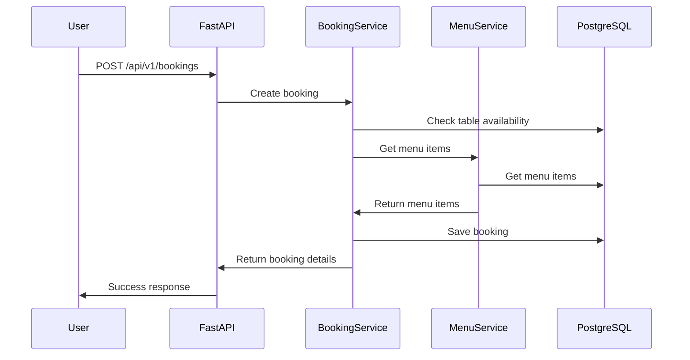
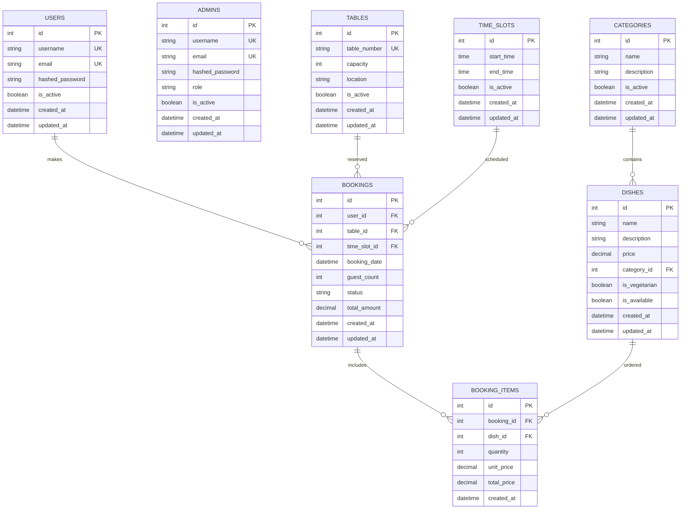

# High-Level Design (HLD) - Little Lemon Restaurant Booking System

## 1. System Overview

### 1.1 Purpose
The Little Lemon Restaurant Booking System is a comprehensive backend application that enables users to book tables, select dishes, and manage reservations for the Little Lemon restaurant. The system provides a seamless booking experience with real-time availability tracking and pricing calculations.

### 1.2 System Goals
- **User Management**: Secure authentication and user profile management
- **Table Booking**: Real-time table availability and reservation management
- **Menu Management**: Dynamic menu with dish selection and pricing
- **Reservation Management**: Complete booking lifecycle from creation to completion
- **Availability Tracking**: Real-time slot availability and capacity management
- **Pricing Engine**: Dynamic pricing based on time, demand, and selections

### 1.3 Key Features
- JWT-based authentication and authorization
- Real-time table availability checking
- Dynamic menu with categories and pricing
- Reservation management with status tracking
- Admin dashboard for restaurant management
- Payment integration (future enhancement)

## 2. System Architecture

### 2.1 High-Level Architecture Diagram

### 2.2 Technology Stack

#### Backend Framework
- **FastAPI**: Modern, fast web framework for building APIs
- **Python 3.9+**: Programming language
- **SQLAlchemy 2.0**: ORM for database operations
- **Alembic**: Database migration tool

#### Database
- **PostgreSQL**: Primary relational database

#### Authentication & Security
- **JWT**: JSON Web Tokens for authentication
- **bcrypt**: Password hashing
- **CORS**: Cross-Origin Resource Sharing

#### Development Tools
- **Poetry**: Dependency management
- **Black**: Code formatting
- **isort**: Import sorting
- **pre-commit**: Git hooks

## 3. Core Modules

### 3.1 Authentication Module
- User registration and login
- JWT token generation and validation
- Password hashing and verification
- User profile management

### 3.2 Booking Module
- Table availability checking
- Reservation creation and management
- Booking status tracking
- Conflict resolution

### 3.3 Menu Module
- Dish and category management
- Pricing configuration
- Availability tracking
- Dietary information

### 3.4 User Management Module
- User profile management
- Booking history
- Preferences management
- Admin user management

### 3.5 Admin Module
- Admin user management
- Restaurant management
- Booking oversight
- System configuration

## 4. Data Flow

### 4.1 User Registration Flow

### 4.2 Booking Flow

## 5. Database Design

### 5.1 Entity Relationship Diagram

## 6. API Design

### 6.1 RESTful API Endpoints

#### Authentication Endpoints
- `POST /api/v1/auth/signup` - User registration
- `POST /api/v1/auth/signin` - User login
- `POST /api/v1/auth/refresh` - Refresh JWT token
- `POST /api/v1/auth/logout` - User logout

#### User Management Endpoints
- `GET /api/v1/users/profile` - Get user profile
- `PUT /api/v1/users/profile` - Update user profile
- `GET /api/v1/users/bookings` - Get user bookings

#### Booking Endpoints
- `GET /api/v1/bookings` - List bookings
- `POST /api/v1/bookings` - Create booking
- `GET /api/v1/bookings/{id}` - Get booking details
- `PUT /api/v1/bookings/{id}` - Update booking (including status changes)
- `DELETE /api/v1/bookings/{id}` - Delete booking (admin only)

#### Menu Endpoints
- `GET /api/v1/menu/categories` - List categories
- `GET /api/v1/menu/dishes` - List dishes
- `GET /api/v1/menu/dishes/{id}` - Get dish details

#### Availability Endpoints
- `GET /api/v1/availability/slots` - Get available time slots
- `GET /api/v1/availability/tables` - Get available tables

#### Admin Endpoints
- `GET /api/v1/admin/bookings` - List all bookings
- `PUT /api/v1/admin/bookings/{id}/status` - Update booking status
- `GET /api/v1/admin/analytics` - Get booking analytics
- `GET /api/v1/admin/users` - List all users
- `PUT /api/v1/admin/users/{id}/status` - Update user status
- `GET /api/v1/admin/menu` - Manage menu items
- `POST /api/v1/admin/menu/categories` - Create category
- `POST /api/v1/admin/menu/dishes` - Create dish

## 7. Security Design

### 7.1 Authentication & Authorization
- JWT-based authentication
- Role-based access control (User, Admin)
- Admin-specific authentication middleware
- Token refresh mechanism
- Secure password hashing with bcrypt

### 7.2 Data Protection
- Input validation and sanitization
- SQL injection prevention
- XSS protection
- CORS configuration

### 7.3 Request Validation
- Input validation and sanitization
- Request size limits
- Content type validation

## 8. Performance Considerations

### 8.1 Application Performance
- Async/await for I/O operations
- Efficient API response formatting
- Optimized database queries
- Connection pooling

### 8.3 Scalability
- Horizontal scaling capability
- Load balancing ready
- Microservices architecture potential
- Containerization support

## 9. Deployment Architecture

### 9.1 Development Environment
- Local PostgreSQL database
- Docker containerization
- Hot reload for development

### 9.2 Production Environment
- Cloud deployment (AWS/Azure/GCP)
- Database clustering
- Load balancer
- CDN for static assets
- Monitoring and logging

## 10. Monitoring & Logging

### 10.1 Application Monitoring
- Health check endpoints
- Performance metrics
- Error tracking
- User activity monitoring

### 10.2 Logging Strategy
- Structured logging
- Log levels (DEBUG, INFO, WARNING, ERROR)
- Centralized log management
- Audit trail for bookings

## 11. Testing Strategy

### 11.1 Testing Levels
- Unit testing for services
- Integration testing for APIs
- End-to-end testing
- Performance testing

## 12. Future Enhancements

### 12.1 Phase 2 Features
- Payment gateway integration
- SMS notifications
- Advanced analytics dashboard
- Mobile app API optimization

### 12.2 Phase 3 Features
- Multi-restaurant support
- Loyalty program
- Advanced reporting
- AI-powered recommendations

## 13. Risk Assessment

### 13.1 Technical Risks
- Database performance under high load
- Third-party service dependencies
- Security vulnerabilities
- Data consistency issues

## 14. Implementation Phases

### 14.1 Phase 1: Core Authentication & User Management (Week 1)
- ✅ User registration and authentication (already implemented)
- ✅ JWT token implementation (already implemented)
- ✅ Basic user profile management (already implemented)
- Admin user management
- Admin authentication middleware

### 14.2 Phase 2: Menu & Table Management (Week 2)
- Menu categories and dishes
- Table management system
- Availability tracking
- Basic booking functionality

### 14.3 Phase 3: Booking System (Week 3)
- Complete booking workflow
- Booking status management
- Conflict resolution
- Booking history

### 14.4 Phase 4: Admin Dashboard (Week 4)
- Admin authentication middleware
- Admin booking management
- User management interface
- Analytics and reporting 